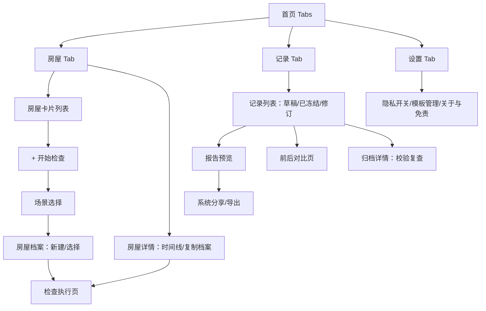

# 租房留证册 · 产品设计文档

| 项目 | 内容 |
| --- | --- |
| 产品名称 | 租房留证册（RentalBooklet） |
| 文档版本 | v1.1 |
| 撰写日期 | 2026-09-13（v1.1 修订：2026-09-15） |
| 文档状态 | 已评审（v1.1 范围修订已确认） |
| 关联文档 | [02-技术设计文档](./02-技术设计文档.md) · [03-功能链路设计](../flows/03-功能链路设计.md) · [v1 收官计划](../plans/2026-09-15-v1收官计划.md) |
| 目标平台 | HarmonyOS NEXT 6.0.1（API 21），手机优先、平板适配 |

### 修订记录

| 版本 | 日期 | 变更 |
| --- | --- | --- |
| v1.0 | 2026-09-13 | 初版 |
| v1.1 | 2026-09-15 | M2 完成后的中期评审范围修订：① 冻结→PDF→OCR 里程碑重排（核心价值闭环优先）；② 签名画板降级 v1.1，v1 用参与人文本确认；③ zip 原图包降级为多文件分享/逐文件导出；④ SnapshotRenderer 降级方案裁剪，真机不可用时明确提示；⑤ 记录 Tab 草稿列表升级为 v1 硬性要求；⑥ "导出全部数据"从 M7 提前至设置页 v1 首批；⑦ 移除 INTERNET 权限（逆地理推迟 v1.1）；⑧ 新增对比对齐防回归单测要求 |

---

## 1. 产品概述

### 1.1 一句话价值

入住、维修、退租时，按引导拍完一套照片，自动生成可长期保存和分享的房屋状况报告。

### 1.2 产品边界（产品"不是什么"）

以下定位在所有界面、文案、商店描述中必须一致，属于不可协商的红线：

1. **不是法律取证或司法鉴定工具**：不宣称证据效力，不提供"存证"服务。
2. **不判断责任归属**：只展示"入住时如何、退租时如何"，由用户自行确认与判断。
3. **校验值只回答"文件是否变过"**：SHA-256 只用于检测文件在生成后是否被修改，不代表司法鉴定或官方存证。
4. **完整度不叫评分**：界面措辞统一为"记录完整度"，禁止出现"证据有效性评分"等表述。
5. **不做云端责任认定、不生成投诉/诉讼文书**（暂缓清单，见 1.5）。

### 1.3 解决的三个问题

1. 应该拍什么——按模板与路线引导，避免遗漏；
2. 照片与问题描述一一对应——每个检查项挂接全景照、细节照与备注；
3. 几个月后仍能快速找到原始记录——房屋档案 + 冻结报告 + 校验清单 + 全文可搜索。

### 1.4 目标用户

| 画像 | 典型场景 | 核心诉求 |
| --- | --- | --- |
| 毕业生租客"小李" | 入住当天 15~20 分钟完成验房，一年后退租自证 | 快、不遗漏、找得到当时的照片 |
| 多套房房东"王女士" | 三套房反复交接，争议集中在表数/钥匙/家电 | 模板复用、双方确认、各自留档 |
| 维修记录者 | 空调漏水报修，记录维修前中后 | 一页式维修记录，下次漏水有据可查 |

### 1.5 商业模式（约束，不影响 v1 范围）

按报告付费或应用买断，不强行订阅；v1 不内嵌任何付费墙（先验证价值）。

---

## 2. 用户故事（v1 验收口径）

| 编号 | 用户故事 | 验收要点 |
| --- | --- | --- |
| US-01 | 作为租客，我打开 App 不注册，就能选择"入住验房"开始检查 | 无注册登录；场景选择 ≤ 2 步 |
| US-02 | 作为租客，我填最少信息就能建立房屋档案 | 仅房屋简称必填，其余可跳过 |
| US-03 | 作为租客，我跟着"入户门→客厅→…→钥匙"的路线边走边拍 | 路线自动生成；随时中断、随时续作 |
| US-04 | 作为租客，我能给每个检查项标记 正常/存在问题/不适用 | 三态一键切换；问题项引导补充照片或备注 |
| US-05 | 作为租客，我想用语音描述问题而不是打字 | 语音转写 + 中性化建议，逐条可采纳/拒绝 |
| US-06 | 作为租客，我希望 App 帮我读水电燃气表 | OCR 识别候选读数，必须经我确认才写入报告 |
| US-07 | 作为租客，检查完成前 App 提醒我漏拍了什么 | 完整度清单 + 一键跳转到遗漏项 |
| US-08 | 作为租客与房东，我们双方确认后冻结本次记录 | 冻结后不可改；修改只能生成修订版本 |
| US-09 | 作为租客，我要把报告发给房东，对方不装 App 也能看 | PDF 可独立阅读；支持系统分享 |
| US-10 | 作为租客，一年后退租时我要和入住报告逐项对比 | 复用入住结构，逐项对照，我来确认"有无变化" |
| US-11 | 作为房东，三套房每次交接直接复制上次档案 | 复制房屋档案创建新检查 |
| US-12 | 作为用户，我要确信几个月后文件没被动过 | 校验清单页重新计算 SHA-256 并给出"未变化/已变化" |

---

## 3. 场景与模板设计

### 3.1 场景清单

用户打开 App 首先选择场景，不同场景加载不同模板，避免空白表单：

| 场景 Key | 名称 | 模板侧重 | 交接数据 | 对比基线 |
| --- | --- | --- | --- | --- |
| `move_in` | 入住验房 | 全屋完整检查 | 表读数 + 钥匙门禁 | 作为后续退租的基线 |
| `move_out` | 退租交房 | 与入住同构的完整检查 | 表读数 + 钥匙门禁 | 自动建议选择入住记录为基线 |
| `repair` | 中途维修 | 故障点 + 维修过程 | 维修人员/费用 | 可选 |
| `cleaning` | 家政保洁 | 保洁前重点区域 + 同角度后拍 | 无 | 保洁前记录 |
| `appliance` | 家电交付 | 逐台家电型号/序列号/通电 | 附件清单 | 可选 |
| `custom` | 自定义检查 | 从模板库勾选房间与项目 | 可选 | 可选 |

### 3.2 入住验房模板（核心资产，v1 内容基线）

检查路线固定为：**入户门 → 客厅 → 阳台 → 厨房 → 卫生间 → 主卧 → 次卧 → 水电燃气表 → 钥匙与门禁**。房间按户型增删（如无阳台/次卧自动移除；复式追加"次卫/书房"为 v1.1 预留，2026-09-19 审查确认 v1 未实现）。

每个房间固定检查项如下（每项建议拍 1 张全景 + 问题处 1 张细节；★ 为必查项）：

| 房间 | 检查项 |
| --- | --- |
| 入户门 | ★门体外观（划痕/凹陷）、★门锁与把手开合、猫眼、门铃、密封条、门口地面 |
| 客厅 | ★墙面（污渍/裂缝/水渍）、天花板与吊顶、★地板/瓷砖（划痕/空鼓）、★窗户与纱窗、窗帘及轨道、灯具与开关、插座通电、空调外观与运行 |
| 阳台 | 地面与排水口、栏杆稳固、晾衣设施、洗衣机位（若在此） |
| 厨房 | ★橱柜门板与铰链、★台面（划痕/烫痕）、★水龙头与下水、★燃气灶、油烟机、燃气阀门、墙面瓷砖、地漏 |
| 卫生间 | ★马桶（冲水/底座密封）、★洗手台与下水、淋浴区（花洒/挡水条）、镜柜、排风扇、★地漏排水、渗漏痕迹、瓷砖空鼓 |
| 主卧 | ★墙面、地板、★窗户与锁扣、衣柜（门/隔板/抽屉）、空调、窗帘、插座 |
| 次卧 | 同主卧（可精简衣柜项） |
| 水电燃气表 | ★电表读数、★水表读数、★燃气表读数、表具编号与安装位置 |
| 钥匙与门禁 | ★钥匙数量、★门禁卡数量、车位/储物凭证（可选） |

> 退租交房模板与上表完全同构（这是"前后对比"按 template_key 对齐的前提）；中途维修模板为线性 6 步：故障位置 → 故障描述与拍照 → 维修人员与时间 → 更换零件 → 费用凭证 → 维修后运行状态。

### 3.3 检查项三态与录入要求

| 状态 | 含义 | 录入要求 |
| --- | --- | --- |
| 正常（OK） | 该项检查过、无异常 | 建议至少 1 张全景照 |
| 存在问题（ISSUE） | 有异常 | **软规则**：至少 1 张照片或 1 条备注（不满足时完整性检查会列出，允许"说明原因后通过"） |
| 不适用（NA） | 房屋没有该项 | 无照片要求，需留空确认 |
| 未检查（PENDING） | 尚未处理 | 进入下一环节前会出现在完整性检查中 |

### 3.4 拍摄规范

- **全景照**：证明问题位于哪个房间、哪个位置（建议站在门口视角）。
- **细节照**：展示划痕、破损、霉斑或表盘读数（贴近拍摄，光线充足）。
- **来源标记**：App 内即时拍摄记为 `即时拍摄`；从相册选择的旧照片强制标记 **"从相册导入"**，在照片角标与 PDF 中体现，绝不伪装成即时拍摄。
- **拍摄元数据自动附加**：房间与检查项名称、拍摄时间、可选位置、原始照片 SHA-256、用户备注。

### 3.5 轻量质量提示（启发式，非判定）

| 提示 | 触发条件（v1 启发式） |
| --- | --- |
| 照片过暗 | 缩略图平均亮度低于阈值 |
| 可能模糊 | 像素抽样梯度方差低于阈值（v1 可降级为"未开启"） |
| 表盘未拍完整 | 仅在表读数项：提醒框选引导，不做识别判断 |
| 缺少全景照 | 该房间 0 张全景照（建议级提示） |
| 只有文字没有照片 | ISSUE 项无照片（建议级提示） |

---

## 4. 信息架构与页面结构

### 4.1 信息架构

### 4.2 页面清单（v1 共 14 个路由页）

| # | 路由名 | 页面 | 关键内容 |
| --- | --- | --- | --- |
| 1 | `home` | 首页（Tabs） | 房屋列表 / 记录列表 / 设置 三个 Tab |
| 2 | `sceneSelect` | 场景选择 | 6 个场景卡片 |
| 3 | `houseEdit` | 房屋档案编辑 | 新建/编辑，仅简称必填 |
| 4 | `houseDetail` | 房屋详情 | 检查时间线、复制档案创建新检查 |
| 5 | `inspection` | 检查执行页 | 房间进度 + 当前房间检查项列表 |
| 6 | `itemEdit`（半模态） | 检查项编辑 | 三态、拍照、备注、语音、质量提示 |
| 7 | `meterOcr` | 表读数确认 | 拍表盘 → OCR 候选 → 手动确认 |
| 8 | `review` | 完整性检查 | 记录完整度 + 遗漏清单 + 一键跳转 |
| 9 | `confirmSign` | 确认与冻结 | 摘要核对 + 参与人文本确认（签名画板 v1.1） + 补充说明 |
| 10 | `reportPreview` | 报告预览 | PDF 逐页预览、重新生成 |
| 11 | `archiveDetail` | 归档详情 | manifest 校验复查、修订历史 |
| 12 | `compare` | 前后对比 | 逐项对照 + 用户确认有无变化 |
| 13 | `settings` | 设置 | 位置开关、模板管理、关于与免责 |
| 14 | — | 首启免责弹窗 | 固定文案，必须确认 |

> **v1.1 硬性要求**：记录 Tab 必须展示真实数据（草稿/已冻结/修订），不允许占位空态。中断的草稿是产品三大承诺之一（US-03/US-07），入口不得只藏在房屋详情页。

### 4.3 核心页面交互要点

**检查执行页**（高频主战场）：
- 顶部：房屋名 · 场景 · 进度环（18/24）；房间横向步进条（入户门→…→钥匙），当前房间高亮，已完成房间打勾；
- 中部：当前房间检查项卡片列表（名称 + 三态按钮 + 照片缩略图角标 + 备注摘要）；
- 底部："上一间 / 下一间"，自动跳到第一个 PENDING 项；
- 每次操作**即时写库**，杀进程后回到原位（中断续作）。

**检查项编辑半模态**：三态切换 → 拍照（全景/细节两个入口）→ 从相册导入 → 备注输入 + 麦克风语音 → 中性化建议对照条 → 完成即回列表。

**确认与冻结页**（v1.1 修订）：检查时间、参与人姓名（文本确认，v1 不做签名画板）、三表读数、钥匙门禁数量、问题总数、补充说明。参与人与确认时间随记录冻结存档；签名画板（Canvas 手写 PNG）推迟至 v1.1。

---

## 5. 功能规格

### 5.1 房屋档案

| 字段 | 必填 | 说明 |
| --- | --- | --- |
| 房屋简称 | ✅ | 如"滨江公寓 1508"；首页/卡片/分享外显仅用此字段 |
| 检查/入住日期 | ✅ | 默认今天 |
| 户型 | ✅ | 选择器：X室X厅X卫X阳台，驱动房间清单裁剪 |
| 房东/租客称呼 | 可选 | 手机号可选；不参与任何上传 |
| 租约结束日期 | 可选 | 到期前可在首页温和提醒"准备退租检查" |
| 是否记录位置 | 默认关 | 开启后照片可附 GPS；关闭时不请求定位权限 |
| 完整地址 | 可选 | **默认隐藏**，仅导出 PDF 时按开关决定是否包含 |

### 5.2 记录完整度（第 7 步规则）

显示 = **必须完成项完成率** + **建议项完成率** 两个数字，以及遗漏清单：

| 规则 | 级别 | 内容 |
| --- | --- | --- |
| R1 | 必须 | 所有必查房间至少 1 个项目被处理（非 PENDING） |
| R2 | 必须 | 电/水/燃气每类表读数：已确认读数 或 标记"无表具/无法读取" |
| R3 | 必须 | 钥匙与门禁数量已确认（或标记"无需记录"） |
| R4 | 必须 | 每个 ISSUE 项有照片或备注，或勾选"说明原因通过" |
| R5 | 建议 | 每个房间至少 1 张全景照 |
| R6 | 建议 | 入户门有近照 |
| R7 | 建议 | ISSUE 项备注经中性化处理（不强制） |

**措辞红线**：页面标题"记录完整度"，说明文字"反映本次记录的齐全程度，不代表证据效力"。

### 5.3 确认与冻结

确认页汇总后，用户点击"冻结本次记录"：

1. 冻结生成报告编号 `RB-YYYYMMDD-xxxx`；
2. 系统对照片原图等原始文件计算 SHA-256，写入**校验清单（manifest）**；
3. 记录进入只读状态，完整度与表读数快照固化；
4. PDF 不随冻结自动生成：进入报告预览页后手动点击"生成 PDF"，可随时重新生成覆盖。

**修订版本机制**：冻结后需要修改时，不覆盖原记录——复制生成"修订版本 R1/R2…"（关联原记录），在新版本上继续编辑并重新冻结；归档详情页可查看版本历史。老报告永远保持冻结时原样。v1 提供修订链数据结构与"复制创建新检查"入口，完整版本历史管理页推迟 v1.1。

### 5.4 交付包（v1.1 修订：不做 zip 打包）

| 产物 | 内容 | 接收方要求 |
| --- | --- | --- |
| PDF 报告 | 见 5.5 | 无需安装 App，任何设备可读 |
| 原始照片 | 系统分享面板多文件分享（按房间命名）或 DocumentViewPicker 逐文件导出 | 长期归档 |
| App 内档案 | 可搜索（房屋名/检查项/备注全文） | 本机 |
| manifest.json | 校验清单文件随分享/导出一并交付 | 人工核对 |

> v1.1 修订：`@ohos.zlib` 目录压缩能力不做打包赌注（原风险 R5），首发即走多文件分享；若后续验证 zlib 可靠再引入 zip。

**数据逃生口（提前实现）**：纯本地数据意味着换机/卸载即丢失。设置页提供"导出全部数据"（沙箱目录级导出），首次建档时温和提示一次"数据仅存本机，请定期导出归档"。

### 5.5 PDF 报告结构

1. **封面**：报告编号、房屋简称、场景、检查时间、参与人；（可选）完整地址
2. **交接数据**：水电燃气表读数（含照片缩略）、钥匙/门禁数量、补充说明
3. **逐房间页**：房间标题 → 全景照 → 检查项表格（状态/描述/细节照缩略 + 原图编号）
4. **问题汇总**：所有 ISSUE 项一览表（房间、项目、描述、照片编号）
5. **确认信息**：参与人姓名与确认时间（v1.1 修订：签名页随签名画板推迟）
6. **文件校验信息**：manifest 摘要（文件名 + SHA-256 摘要 + 说明"仅用于检测文件变化"）+ 固定免责文案

### 5.6 前后对比（第 9 步）

- 退租检查默认**建议选择入住报告为基线**，复用其房间与检查项结构（按 template_key 对齐）；
- 对比页逐项呈现：入住照片/描述 ↔ 退租照片/描述；
- 用户逐项确认：**无变化 / 有变化 / 待确认**；App 只呈现与记录，不自动断言变化成因与责任归属；
- 汇总表（有变化项清单）进入退租 PDF；
- **对齐防回归约束（v1.1 新增）**：对比按 (room.template_key, check_item.template_key) 复合对齐；`move_in` 与 `move_out` 模板的该复合键集合必须完全一致，以单测断言锁死，防止后续改模板时悄悄破坏对齐。对不上的项目标"新增项"。

### 5.7 语音备注与中性化改写

- 长按/点击麦克风 → 端侧语音转写（≤60 秒/次，中文）；
- App 对转写文本给出**中性化建议**（对照展示，逐条采纳或保留原文）：
  - 主观/情绪词 → 客观描述："很脏" → "存在明显污渍"；
  - 口语量化 → 规范表达："十厘米左右" → "约 10 厘米"；
  - 建议句式：**位置 + 对象 + 现象 + 尺寸/程度**；
  - 去除对话归因与责任猜测（"房东说…"、"是我弄坏的…"）。
- 示例：原话"主卧窗户左下角有一条十厘米左右的裂缝，入住时已经存在" → 建议"主卧窗户左下角可见线状裂纹，长度约 10 厘米（入住时已存在）"。
- AI 只整理语言，不判断成因与责任；建议与原文均存库，报告采用用户最终采纳的文本。

### 5.8 表读数 OCR

- 表读数项 → 拍摄表盘（带取景引导）→ OCR 识别候选值与原文 → **用户必须确认或手动修正**才写入 → 写入后标记"已确认"，与原始识别值、置信度一同存档；
- 未确认的读数不会出现在报告中；低置信度（或识别失败）时直接引导手动输入，不打断流程。

---

## 6. 隐私与合规设计

1. **无账号、纯本地**：不注册登录，所有数据存本机沙箱与加密数据库；不上传任何照片或文本。
2. **权限最小化**（v1.1 修订：INTERNET 移除，逆地理随 v1.1 再评估）：
   - 拍照走系统相机选择器 → **不申请相机权限**；
   - 相册导入走系统图库选择器 → **不申请媒体库权限**；
   - 申请的仅：`MICROPHONE`（语音备注，用到才弹）、`LOCATION`（默认关，用户开启档案"记录位置"才弹）。
3. **隐私外显**：首页只显示房屋简称，完整地址默认隐藏。
4. **首启免责弹窗**（固定文案，须法务评审后进入关于页）：

   > 本应用仅帮助您整理和保存房屋状况记录，不构成法律取证、司法鉴定或官方存证工具，也不能判断任何责任归属。文件校验值仅用于检测文件在生成后是否发生变化。请以实际需要自行决定如何使用本应用产出的材料。

5. **数据备份**：接入系统备份能力（BackupExtension），用户换机时可随系统备份迁移；App 内提供"导出全部数据"入口（归档包）。

---

## 7. 鸿蒙生态特性（v1 范围）

| 特性 | v1 方案 |
| --- | --- |
| 服务卡片 | 2x2 检查进度卡片："房屋名 · 场景 · 完成度 18/24"，点击直达检查页；进度变化时主动刷新（无需高频定时） |
| 华为分享 / Share Kit | PDF + 原图包走系统分享面板（微信/邮件/华为分享等） |
| 平板一多 | `deviceTypes` 增加 tablet；检查执行页/对比页在宽屏用双栏（左房间树 + 右内容） |
| 实况窗 | **不做**（单次检查十几分钟，卡片 + 通知足够）——与 brief 决策一致 |
| 碰一碰 OneHop | 不单独集成（未对普通开发者开放），分享面板自带碰一碰通道即可 |

---

## 8. 非功能需求

| 维度 | 指标 |
| --- | --- |
| 拍照入库 | 从相机返回到列表可见缩略图 ≤ 1s（原图落盘/哈希异步） |
| 完整性检查计算 | ≤ 200ms（千项以内） |
| 冻结事务 | 20 个文件 SHA-256 ≤ 5s（后台并行，进度可见） |
| PDF 生成 | 30 页以内 ≤ 20s，后台执行可取消 |
| 中断续作 | 任意时刻杀进程零数据丢失（全操作即时写库），重进从首页草稿卡片继续 |
| 存储 | 原图按沙箱保留；提供未冻结草稿清理工具与空间占用展示 |
| 可用性 | 全中文优先；深浅色跟随系统；字号跟随系统 |
| 兼容 | API 21 起（HarmonyOS 6.0.1），Phone + Tablet |
