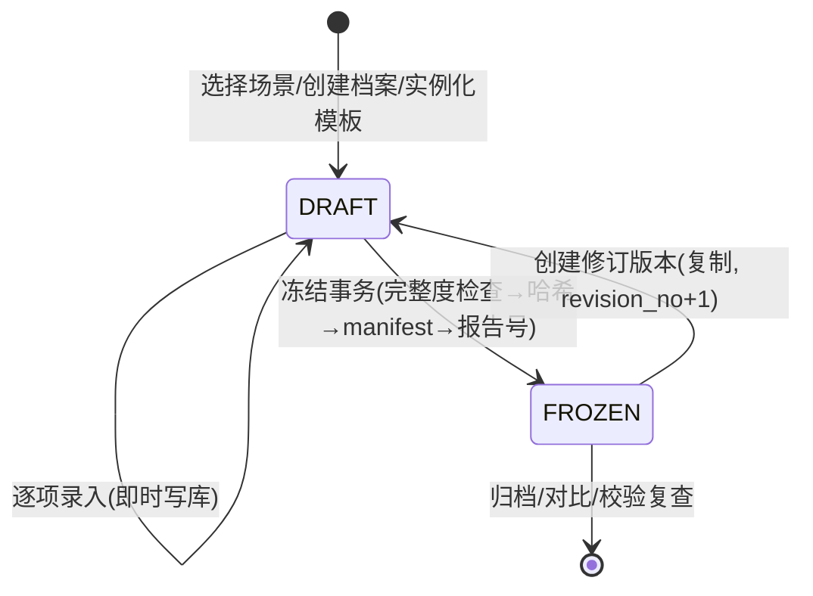

# 租房留证册 · 技术设计文档

| 项目 | 内容 |
| --- | --- |
| 文档版本 | v1.1 |
| 撰写日期 | 2026-09-13（v1.1 修订：2026-09-15） |
| 文档状态 | 已评审（v1.1 范围修订已确认） |
| 关联文档 | [01-产品设计文档](./01-产品设计文档.md) · [03-功能链路设计](../flows/03-功能链路设计.md) · [v1 收官计划](../plans/2026-09-15-v1收官计划.md) |

### 修订记录

| 版本 | 日期 | 变更 |
| --- | --- | --- |
| v1.0 | 2026-09-13 | 初版 |
| v1.1 | 2026-09-15 | ① 状态管理按实际落地修正为 V1 装饰器 + AppStorage 信号（V2 迁移推迟）；② 模板承载修正为 TS 常量（BuiltinTemplates.ets），parseSceneTemplate 保留供 v1.1 自定义导入；③ D1 补充 pdfService 实测签名，SnapshotRenderer 裁剪；④ D7 zip 裁剪为多文件分享；⑤ 新增 DB v2 迁移（compare_result 表、waiver_reason、pdf_sha256）；⑥ 权限清单移除 INTERNET；⑦ 新增对比对齐单测约束 |

---

## 1. 工程基线

| 项 | 值 | 说明 |
| --- | --- | --- |
| SDK | `targetSdkVersion / compatibleSdkVersion = 6.0.1(21)` | 工程已配置（`build-profile.json5`） |
| 模型 | Stage 模型，`modelVersion 6.0.1` | 模板现状 |
| 语言 | ArkTS 严格模式 | 不使用 any/动态属性等受限语法 |
| 入口 | `EntryAbility`（已存在）+ `EntryBackupAbility`（已存在，type=backup） | 模板现状 |
| 设备 | phone + tablet（已配置） | v1.1 确认 |
| 三方依赖 | v1 **零三方运行时依赖**（官方 Kit 已覆盖全部需求） | 降低供应链与兼容风险 |
| UI 架构 | Navigation + NavPathStack 路由 | API 21 全量可用 |
| 状态管理 | **V1 装饰器（@State/@Provide）+ AppStorage('home_dirty') 刷新信号**（v1.1 修正：M0~M2 已按此落地，V2（@ObservedV2/@Trace/@Local）迁移推迟至 v1.1 评估） | 避免混用两代状态管理 |
| 模板承载 | **TS 常量 `BuiltinTemplates.ets`**（v1.1 修正：非 assets JSON；无 IO、类型安全、可直接单测）；`TemplateEngine.parseSceneTemplate` 保留，供 v1.1 自定义模板导入 | M0 执行计划已确认该偏差 |
| 并发 | TaskPool 执行哈希/PDF 等重活（缩略图编解码在 native 线程，M2 实测无需 TaskPool；真机性能不达标再迁移，接口已 async 化） | 主线程只做 UI 与轻量 DB |

## 2. 总体架构

单 `entry` HAP（v1），内部按"功能域 → 领域 → 数据 → 基础设施"分层；目录约定为未来拆 HAR 预留边界（见 8. 演进）。

```mermaid
flowchart TB
    subgraph UI["UI 层 ets/pages + ets/features"]
        P1[首页/场景/档案] --- P2[检查执行/项目编辑] --- P3[OCR/语音/备注]
        P4[完整性/确认签名] --- P5[报告/归档/对比] --- P6[设置/卡片]
    end
    subgraph Domain["领域层 ets/domain（纯 TS，可单测）"]
        D1[模板引擎 TemplateEngine]
        D2[完整性规则 CompletenessEngine]
        D3[文本中性化 TextRefiner]
        D4[状态机 InspectionStateMachine]
        D5[manifest/校验 ManifestBuilder]
        D6[PDF 文档模型 ReportComposer]
    end
    subgraph Data["数据层 ets/data"]
        RDB[(RDB 加密库\nrelationalStore)]
        FS[(沙箱文件\nfilesDir)]
        PREF[(preferences\n开关/上次位置)]
    end
    subgraph Infra["基础设施 ets/infra（Kit 封装，可替换/可降级）"]
        K1[ReportRenderer\nPDF Kit / 截图降级]
        K2[CaptureService\ncameraPicker]
        K3[OcrService\nCoreVision textRecognition]
        K4[SpeechService\nCoreSpeech]
        K5[HashService\nCoreFileKit hash]
        K6[ZipService\n@ohos.zlib]
        K7[ShareService\nShareKit systemShare]
        K8[PickerService\n图库/文档 picker]
        K9[LocationService\nLocationKit]
        K10[WidgetService\nFormKit]
    end
    UI --> Domain --> Data
    Domain --> Infra
    Infra --> Data
```

**分层规则**：

- `domain/` 只含纯 TS 逻辑与模型（不 import UI、不 import Kit），全部可被 hypium 单测覆盖；
- `infra/` 每个 Kit 一个薄封装（接口 + 实现 + 错误码归一），UI/领域只依赖接口，为"模拟器降级/未来替换"留缝；
- `data/` 仓库（Repository）模式：`HouseRepo / InspectionRepo / PhotoRepo / ManifestRepo / TemplateRepo`，页面不直接写 SQL。

## 3. 关键技术决策（ADR）

> 以下决策基于 2026-09 对华为官方文档的核实，均已验证 API 存在性与约束；每条含被否方案与理由。

### D1 PDF 生成：PDF Kit（pdfService）主路径，PdfView 预览（v1.1 修订）

- **实测签名（2026-09-15 官方文档复核）**：
  - `new pdfService.PdfDocument()` → `createDocument(width, height)` 创建空白文档；
  - `insertBlankPage(index, width, height): PdfPage` 插页；`getPage(index): PdfPage`；
  - `page.addTextObject(text: string, x, y, style: TextStyle): void`——**只可按行添加**，`TextStyle = { textColor: number, textSize: number, fontInfo: FontInfo }`；字体经 `new Font().getFontByName('HarmonyOS Sans')?.path` 取系统字体路径；
  - `page.addImageObject(path, x, y, width, height): void`——图片格式约束见 D10（统一 JPEG）；
  - `saveDocument(path): boolean` → `releaseDocument()` 释放；
  - **预览**：`PdfView` 组件（PDF Kit 自带，`PdfViewController` 加载沙箱路径），reportPreview 页直接内嵌真实 PDF 预览。
- **降级策略（v1.1 修订：SnapshotRenderer 裁剪）**：pdfService 仅中国大陆真机可用。检测到不可用时（`saveDocument` 失败/异常），报告页明确提示"当前设备不支持生成 PDF，请在支持的设备上生成"，**不再维护截图合成降级渲染器**——为调试场景维护双渲染器性价比低，冒烟验证在真机进行。
- **被否方案**：NDK libharu；纯 TS 三方库（ohpm 无成熟选项）；Print Kit（无导出接口）；SnapshotRenderer（v1.1 裁剪，理由如上）。

### D2 拍照：cameraPicker，不申请相机权限

- `@kit.CameraKit` 的 `cameraPicker.pick(context, [camera.PickerProfile])` 拉起系统相机，返回 `resultUri`，随后 `fs.copy` 入沙箱 → **免 `ohos.permission.CAMERA`**；
- 自定义取景器（Camera Kit 全自研预览）被否：v1 的引导（房间/项目名叠加）由"拍前确认页"承担，不需要自绘相机；省一个高危权限与大量工作。
- 相册导入：`PhotoViewPicker.select()`，同样**免媒体库权限**。

### D3 OCR：Core Vision Kit textRecognition（端侧离线）

- `import { textRecognition } from '@kit.CoreVisionKit'`：`recognizeText(VisionInfo{pixelData: PixelMap})`，支持简中/繁中/英/日/韩，离线、免费、返回分块坐标；
- 无"表盘读数"专用 API → 表读数项用**取景引导框 + 最近清晰帧**提高数字块命中，识别结果永远经用户确认（产品规则，见 D8 数据规则）；
- 设备型号/序列号识别：同 API，用户手动选择对应文本块。

### D4 语音：Core Speech Kit speechRecognizer + 本地规则中性化（不上云）

- `@kit.CoreSpeechKit` `speechRecognizer`：端侧离线、zh_CN、单次 ≤60s（检查备注场景足够），需 `MICROPHONE` 权限；
- 中性化改写用**本地规则引擎**（`domain/textRefiner`：词表替换 + 正则量化 + 句式建议），不上云 LLM：隐私（本地数据不出设备）、可用性（无网络依赖）、合规（输出可解释）。v2 再评估端侧/可选云增强。

### D5 存储：加密 RDB + 沙箱文件 + preferences

- `@kit.ArkData` `relationalStore.getRdbStore(config{ name:'rental.db', securityLevel:S2, encrypt:true })`（DB 密钥系统托管）；
- 照片/签名/manifest 等大文件存 `filesDir`（沙箱），DB 只存索引与路径；模板 JSON 随包 assets，首次启动解包校验；
- 轻量 KV（免责声明确认、建档一次性提示等布尔标记）用 preferences；卡片绑定关系（formId ↔ 检查 id）因跨进程访问持久化为 JSON 文件（`{filesDir}/widget/form_bindings.json`，preferences 不支持多进程）；不维护"上次未完成检查"恢复指针——检查数据全操作即时写 RDB，重进从首页草稿卡片继续；
- 数据备份沿用模板内 `EntryBackupAbility`（backup_config 调整包含 DB 与 filesDir）。

### D6 哈希：CoreFileKit hash，而非自研

- 整文件：`import { hash } from '@kit.CoreFileKit'` → `hash.hash(path, 'sha256')`（返回**大写**十六进制，存库统一转小写）；
- 流式（大文件/边生成边算）：`hash.createHash('sha256')` update/digest（API 12+）；
- manifest 内容与算法常量 `SHA-256` 固化（D5 表结构 + 7.3）。

### D7 分享与导出：systemShare + DocumentViewPicker（v1.1 修订：不做 zip）

- 分享：`@kit.ShareKit` `systemShare.SharedData`（构造器传首条 SharedRecord，`addRecord` 追加；记录上限 500 条/IPC 200KB 元数据）→ `ShareController.show()` 拉系统面板；PDF 文件 + 文本摘要 + 原始照片（多文件记录）一次分享；
- 导出保存：`DocumentViewPicker.save()` 让用户选目录（免权限），PDF/manifest.json/照片逐文件导出；SaveButton 安全控件被否（仅适用媒体库图片/视频）；
- **zip 打包裁剪（v1.1）**：原 R5 风险（`@ohos.zlib` 目录压缩能力未验证）不再赌注，v1 直接走多文件分享/逐文件导出；后续版本验证 zlib 可靠后再引入 zip 归档包。

### D8 数据一致性规则（产品级技术约束）

1. OCR/语音/位置等一切识别结果**不直接写入最终数据**，必须落"未确认态"经用户确认（`meter_reading.confirmed`、备注采纳流程）；
2. 照片 `source` 字段忠实记录 `CAPTURED/IMPORTED`，导入照片在 UI 与 PDF 强制标注"从相册导入"；
3. 冻结后记录不可变写：任何修改走"修订版本"（复制记录，`parent_revision_id` 链接）。

### D9 路由与状态：Navigation 体系（不用 router）

- 单 `Navigation` + `NavPathStack`，路由表集中注册（`route_map` 或代码注册）；
- 页面状态用 V2 装饰器；跨页共享用 `AppStorageV2`/服务单例；
- 理由：官方主推、支持半模态/系统转场、平板双栏复用更自然。

### D10 图片管线（拍照/导入统一）

```
cameraPicker/图库 URI
  → fs.copy 到临时文件
  → image 解码 ImageSource
  → 方向/EXIF 校正（orientation）
  → ① 原图：imagePacker 打包 JPEG (quality≈95) 落盘 photos/{id}.jpg
  → ② 缩略图：缩放 ≤1280px JPEG quality≈70 落盘 thumbs/（供列表/PDF 引用，控制 PDF 体积）
  → ③ 质量启发式：抽样像素算平均亮度（过暗）、梯度方差（模糊，v1 可关）
  → DB 写入 photo 索引（path/thumb/宽高/shot_at/source/quality_flags）
  → sha256 延迟到冻结事务统一计算（拍照零等待）
```

> PDF Kit 只吃 JPEG → 管线统一转码 JPEG 顺带解决 HEIF/PNG 兼容；原始字节保真通过"导入照片不动源文件 + manifest 记录导入来源"说明。

## 4. 数据设计

### 4.1 RDB 表结构（SQLite DDL）

```sql
CREATE TABLE house (
  id INTEGER PRIMARY KEY AUTOINCREMENT,
  name TEXT NOT NULL,                 -- 房屋简称（外显）
  full_address TEXT,                  -- 完整地址（默认隐藏）
  layout TEXT NOT NULL,               -- 户型 "2-1-1-1"（室-厅-卫-阳台）
  landlord_name TEXT, landlord_phone TEXT,
  tenant_name TEXT, tenant_phone TEXT,
  lease_end_date INTEGER,             -- 毫秒时间戳，可空
  record_location INTEGER DEFAULT 0,  -- 0/1 位置开关
  created_at INTEGER NOT NULL, updated_at INTEGER NOT NULL
);

CREATE TABLE inspection (
  id INTEGER PRIMARY KEY AUTOINCREMENT,
  house_id INTEGER NOT NULL REFERENCES house(id),
  scene_key TEXT NOT NULL,            -- move_in/move_out/repair/cleaning/appliance/custom
  status TEXT NOT NULL DEFAULT 'DRAFT', -- DRAFT / FROZEN
  baseline_inspection_id INTEGER,     -- 对比基线（退租引用入住）
  parent_revision_id INTEGER,         -- 修订来源
  revision_no INTEGER DEFAULT 0,      -- 0=首版
  report_no TEXT,                     -- 冻结时生成 RB-YYYYMMDD-xxxx
  started_at INTEGER NOT NULL,
  frozen_at INTEGER,
  participants TEXT,                  -- JSON [{role,name,phone}]
  extra_note TEXT,
  complete_required REAL,             -- 冻结时必须项完成率快照
  complete_suggested REAL             -- 建议项完成率快照
);

CREATE TABLE room (
  id INTEGER PRIMARY KEY AUTOINCREMENT,
  inspection_id INTEGER NOT NULL REFERENCES inspection(id),
  template_key TEXT NOT NULL,         -- entrance/living/...
  name TEXT NOT NULL, sort INTEGER NOT NULL
);

CREATE TABLE check_item (
  id INTEGER PRIMARY KEY AUTOINCREMENT,
  room_id INTEGER NOT NULL REFERENCES room(id),
  template_key TEXT NOT NULL,         -- 前后对比的对齐键
  name TEXT NOT NULL, sort INTEGER NOT NULL,
  required INTEGER DEFAULT 1,
  status TEXT DEFAULT 'PENDING',      -- PENDING/OK/ISSUE/NA
  note_raw TEXT,                      -- 语音/手输原文
  note_suggestion TEXT,               -- 中性化建议
  note_final TEXT,                    -- 报告采用文本
  waiver INTEGER DEFAULT 0,           -- ISSUE 无照片/备注时"说明原因通过"
  updated_at INTEGER
);

CREATE TABLE photo (
  id INTEGER PRIMARY KEY AUTOINCREMENT,
  inspection_id INTEGER NOT NULL REFERENCES inspection(id),
  room_id INTEGER, item_id INTEGER REFERENCES check_item(id), -- 表读数/交接照片可空 item
  kind TEXT NOT NULL,                 -- PANORAMA/DETAIL/METER/SIGN/DOC
  source TEXT NOT NULL,               -- CAPTURED/IMPORTED
  path TEXT NOT NULL, thumb_path TEXT,
  width INTEGER, height INTEGER,
  shot_at INTEGER NOT NULL,
  location TEXT,                      -- JSON {lat,lng,addr?}，开关关闭时为 NULL
  quality_flags TEXT,                 -- JSON ["TOO_DARK","BLURRY"...]
  note TEXT,
  sha256 TEXT                         -- 冻结事务回填
);

CREATE TABLE meter_reading (
  id INTEGER PRIMARY KEY AUTOINCREMENT,
  inspection_id INTEGER NOT NULL REFERENCES inspection(id),
  meter_type TEXT NOT NULL,           -- WATER/ELECTRICITY/GAS
  value_text TEXT, unit TEXT DEFAULT '',
  ocr_raw_text TEXT, ocr_conf REAL,
  photo_id INTEGER REFERENCES photo(id),
  confirmed INTEGER DEFAULT 0,        -- 产品规则：confirmed=0 不进报告
  na_flag INTEGER DEFAULT 0,          -- "无表具/无法读取"
  note TEXT
);

CREATE TABLE handover (
  inspection_id INTEGER PRIMARY KEY REFERENCES inspection(id),
  key_count INTEGER, access_card_count INTEGER,
  parking_or_storage TEXT, note TEXT, confirmed INTEGER DEFAULT 0
);

CREATE TABLE signature (
  id INTEGER PRIMARY KEY AUTOINCREMENT,
  inspection_id INTEGER NOT NULL REFERENCES inspection(id),
  role TEXT NOT NULL,                 -- TENANT/LANDLORD/WITNESS
  path TEXT NOT NULL, sha256 TEXT, signed_at INTEGER NOT NULL
);

CREATE TABLE manifest (
  id INTEGER PRIMARY KEY AUTOINCREMENT,
  inspection_id INTEGER NOT NULL REFERENCES inspection(id),
  revision_no INTEGER NOT NULL,
  algorithm TEXT NOT NULL DEFAULT 'SHA-256',
  generated_at INTEGER NOT NULL,
  content TEXT NOT NULL,              -- JSON，见 7.3
  UNIQUE(inspection_id, revision_no)
);

CREATE INDEX idx_inspection_house ON inspection(house_id);
CREATE INDEX idx_room_inspection ON room(inspection_id);
CREATE INDEX idx_item_room ON check_item(room_id);
CREATE INDEX idx_photo_inspection ON photo(inspection_id);
CREATE INDEX idx_photo_item ON photo(item_id);
CREATE INDEX idx_meter_inspection ON meter_reading(inspection_id);
```

#### v2 迁移（v1.1 新增，DB_VERSION 1 → 2）

```sql
-- 前后对比逐项确认结果（挂在退租检查的检查项上）
CREATE TABLE compare_result (
  id INTEGER PRIMARY KEY AUTOINCREMENT,
  inspection_id INTEGER NOT NULL REFERENCES inspection(id),
  item_id INTEGER NOT NULL REFERENCES check_item(id),
  result TEXT NOT NULL DEFAULT 'PENDING',   -- NO_CHANGE / CHANGED / PENDING
  note TEXT,
  updated_at INTEGER,
  UNIQUE(item_id)
);
CREATE INDEX idx_compare_inspection ON compare_result(inspection_id);

ALTER TABLE check_item ADD COLUMN waiver_reason TEXT;  -- R4"说明原因通过"的原因文本
ALTER TABLE inspection ADD COLUMN pdf_sha256 TEXT;     -- PDF 生成后回填，归档详情展示
```

> `DbManager.migrate` 按 `db.version` 追加 `if (current < 2)` 分支；v1 裁剪项（signature 表）保留建表不使用，签名画板随 v1.1 启用。

### 4.2 沙箱文件布局

```
{filesDir}
├── db/rental.db                       -- 加密 RDB
├── houses/{houseId}/insp/{inspectionId}/
│   ├── photos/{photoId}.jpg           -- 原图（统一 JPEG）
│   ├── thumbs/{photoId}_t.jpg         -- ≤1280px 缩略
│   ├── signs/{signatureId}.png        -- 签名
│   ├── report/{reportNo}.pdf          -- 生成产物
│   └── manifest.json                  -- manifest.content 的文件镜像（随原图包分享）
└── tmp/                               -- 转码临时区（启动清理）
```

### 4.3 模板 JSON Schema（assets 内置）

```ts
interface SceneTemplate {
  sceneKey: string;            // move_in / move_out / repair / cleaning / appliance / custom
  title: string;
  rooms: RoomTpl[];            // 顺序即检查路线
  meters: ('WATER'|'ELECTRICITY'|'GAS')[];
  handover: boolean;           // 是否含钥匙/门禁交接
}
interface RoomTpl {
  key: string;                 // 对比对齐键
  name: string;
  items: { key: string; name: string; required: boolean;
           photoGuide: { panorama: boolean; detail: boolean } }[];
}
```

### 4.4 manifest 结构（校验清单）

```json
{
  "reportNo": "RB-20260913-0001",
  "inspectionId": 7, "revisionNo": 0,
  "generatedAt": 1789315200000,
  "algorithm": "SHA-256",
  "files": [
    { "relPath": "photos/101.jpg", "bytes": 2048111, "sha256": "3b1f...e9" }
  ],
  "disclaimer": "校验值仅用于检测文件在生成后是否发生变化，不代表司法鉴定或官方存证。"
}
```

> PDF 自身哈希的"鸡生蛋"问题：PDF 在生成后由 App 计算 hash 并登记到 DB 与归档详情页展示；PDF 校验页列出的是**照片/签名等原始文件**的哈希（manifest 摘要），manifest.json 随原图包分发。

## 5. 状态机



CheckItem 子状态：`PENDING → OK / ISSUE / NA`（可回改，仅限 DRAFT）；ISSUE 受 R4 软规则约束（照片或备注或 waiver）。

## 6. 关键时序

### 6.1 冻结事务（核心一致性点）

```
ConfirmSignPage ──冻结──▶ InspectionService.freeze(id)
 1. CompletenessEngine.check(id) ─→ 有必须项缺失 → 返回遗漏清单(可强制需二次确认)
 2. 生成 reportNo = RB-YYYYMMDD-xxxx（DB 内取当日序号）
 3. TaskPool: 遍历待冻结文件(photo/sign) → hash.hash(path,'sha256') → 回填 photo.sha256
    （幂等：已有 sha256 的跳过；中断重跑只算缺失）
 4. ManifestBuilder.build() → 写 manifest 表 + 落 manifest.json
 5. 单事务 UPDATE inspection SET status='FROZEN', frozen_at, report_no, complete_*（谓词同时限定
    status='DRAFT'：①~④ 均为幂等步骤、可安全重跑，⑤ 为最终提交点；并发/重入时非草稿 0 行命中即回滚）
 6. home_dirty 置位刷新首页列表。PDF 不随冻结自动生成：报告预览页手动点击"生成 PDF"（已生成可重新
    生成覆盖）；分享时携带 PDF + 文本摘要 + 原始照片 + manifest.json（见 D7）
```

### 6.2 拍照入库（见 D10 管线）　6.3 OCR 确认、6.4 语音采纳 → 详见 [03-功能链路设计](../flows/03-功能链路设计.md)

## 7. 领域组件设计要点

### 7.1 TextLineBreaker（PDF 断行器）

- 输入：长文本、版心宽度 px、字号、字重；输出：行数组；
- 实现：逐句/逐词切分 token，`measure.measureText({textContent, fontSize, …})` 累积测宽，超宽即换行；英文单词不拆断、URL 整体换行；
- 被 `ReportComposer` 用于正文、表格单元格；单测覆盖中英混排/标点悬挂。

### 7.2 CompletenessEngine（规则引擎）

- 输入：inspection 聚合（rooms/items/meters/handover/photos）；输出：`{ requiredRate, suggestedRate, issues: [{ruleId, itemId?, message, jumpTarget}] }`；
- 规则以数组注册（R1~R7，见产品文档 5.2），纯函数、可单测、可扩展自定义模板规则。

### 7.3 TextRefiner（中性化规则）

- 规则管道：`分句 → 情绪/主观词替换表 → 口语量化(十厘米→约10厘米) → 归因词剥离 → 句式建议(位置+对象+现象+尺寸)`；
- 每条规则输出 `{before, after, ruleName}`，UI 逐条展示采纳；原文永不丢弃（`note_raw` / `note_final` 双列）。

### 7.4 ReportComposer + PdfKitRenderer（v1.1 修订：渲染器单一化）

- `ReportComposer`：从仓库取数 → 组装 `PdfDocModel`（页序列：封面/交接数据/逐房间页/问题汇总/确认信息/校验信息/免责）；纯领域逻辑，图片只引用缩略图路径；
- `PdfKitRenderer`：`PdfDocModel → pdfService` 调用序列（TextLineBreaker 断行、JPEG 缩略嵌入、表格线绘制）；失败时上抛明确错误码，UI 提示"当前设备不支持生成 PDF"；
- `TextLineBreaker` 的文本测宽通过**注入的测宽函数**实现（`breakLines(text, maxWidth, fontSize, measureFn)`），保持领域层零 ArkUI 依赖可单测；
- ~~SnapshotRenderer~~（v1.1 裁剪）。

## 8. module.json5 变更清单

| 变更 | 内容 |
| --- | --- |
| deviceTypes | 已含 `"phone"` + `"tablet"` |
| requestPermissions | `ohos.permission.MICROPHONE`（reason 文案）、`ohos.permission.APPROXIMATELY_LOCATION` + `ohos.permission.LOCATION`（默认运行时按需）。**v1.1 修订：移除 `ohos.permission.INTERNET`**（逆地理未实现，v1.1 再评估） |
| extensionAbilities | 新增 FormExtensionAbility（type: `form`，卡片进度）+ 保留 backup |
| profile | `form_config.json`（2x2 卡片）、`route_map.json`（Navigation 路由表） |
| skills | EntryAbility 保持 home 实体；卡片 postCardAction router 直达检查页 |

## 9. 错误处理与降级矩阵

| 失败点 | 策略 |
| --- | --- |
| cameraPicker 取消/失败 | 静默返回，无脏数据（临时文件启动清理） |
| OCR 失败/低置信 | 引导手动输入，流程不阻塞（确认规则兜底） |
| 语音识别失败/无权限 | 提示原因 + 跳转手输；权限拒绝后引导设置页 |
| hash 中断 | 幂等重跑（已算文件跳过） |
| PDF 生成失败/超时 | 保留冻结态，报告页可重试；设备不支持时明确提示（v1.1：SnapshotRenderer 已裁剪） |
| 存储不足 | 拍照前检查剩余空间，<200MB 提示清理草稿 |
| 非大陆设备/模拟器 | PDF 生成明确提示不支持；OCR/语音不可用提示真机 |

## 10. 风险登记册（v1.1 修订）

| # | 风险 | 影响 | 缓解 |
| --- | --- | --- | --- |
| R1 | PDF Kit 仅中国大陆真机可用 | 开发期模拟器无法验证主链路 | 明确提示 + 真机冒烟；~~双渲染器~~（v1.1 裁剪 SnapshotRenderer） |
| R2 | `addTextObject` 单行限制 | 排版复杂度上移 | TextLineBreaker 组件化 + 单测 |
| R3 | `addImageObject` 仅 JPEG | HEIF/PNG 崩坏 | D10 统一转码管线（已落地） |
| R4 | 表盘 OCR 精度不稳 | 用户体验打折 | 取景引导 + 手动确认产品规则兜底 |
| ~~R5~~ | ~~zlib 目录压缩未验证~~ | — | **已消解（v1.1）**：不做 zip，直接多文件分享/逐文件导出 |
| R6 | speechRecognizer 模拟器不可用 | 联调推迟 | 真机窗口 |
| R7 | 长检查被杀进程 | 数据丢失观感 | 全操作即时写库（已落地），重进恢复 |
| R8 | 大量照片占满沙箱 | 用户流失 | 空间看板 + 草稿清理 + 数据导出（v1.1 提前实现） |
| R9 | 免责文案合规性 | 上架风险 | 固定文案法务评审后进包 |
| R10 | 换机/卸载导致纯本地数据丢失 | 用户资产损失 | BackupExtension + 设置页"导出全部数据" + 建档时温和提示（v1.1 新增） |

## 11. 测试策略

- **单元（hypium，领域层全覆盖）**：TemplateEngine 实例化/户型裁剪、**move_in 与 move_out 复合对齐键一致性断言（v1.1 新增）**、CompletenessEngine R1~R7、TextRefiner 规则、TextLineBreaker 断行、ManifestBuilder 幂等、状态机流转、reportNo 生成；
- **集成（ohosTest）**：创建→录入（注入样例图）→冻结→PDF/manifest 存在且 hash 匹配；修订版本链；对比对齐；
- **真机冒烟清单**（模拟器不可用项）：pdfService 生成、cameraPicker、speechRecognizer、textRecognition、systemShare、卡片刷新；
- **性能验证**：非功能指标（产品文档 §8）逐项打点（HiLog + hiTrace）。

## 12. 演进预留（v2+）

- 模块拆分：`features/*` → HAR（feature-report、feature-inspection）；`infra/*` → HAR 或 HSP；
- 自定义模板编辑器、多语言、云端备份（用户自有账号体系）、分布式跨端（手机拍→平板看）——当前目录分层不阻碍上述演进。
