# 租房留证册 · 功能链路设计

| 项目 | 内容 |
| --- | --- |
| 文档版本 | v1.1 |
| 撰写日期 | 2026-09-13（v1.1 修订：2026-09-15） |
| 关联文档 | [01-产品设计文档](../design/01-产品设计文档.md) · [02-技术设计文档](../design/02-技术设计文档.md) · [v1 收官计划](../plans/2026-09-15-v1收官计划.md) |

> v1.1 修订摘要：L8 签名画板 → 参与人文本确认；L9 裁剪 zip 打包与 SnapshotRenderer，改多文件分享 + PdfView 预览；L8 前置（冻结先于 OCR，见收官计划）。

本文档把产品主链路拆解为 12 条可开发、可测试、可验收的功能链路。每条链路给出：目标、前置条件、步骤时序、页面与数据写入、异常分支、验收点。

## 0. 总链路（产品主流程）

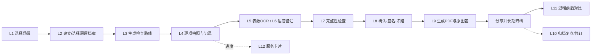

## 1. 页面路由表（Navigation 注册表）

| 路由名 | 页面 | 入参（Params） | 出口 |
| --- | --- | --- | --- |
| `home` | 首页 Tabs（房屋/记录/设置） | — | sceneSelect / houseDetail / archiveDetail / compare / settings |
| `sceneSelect` | 场景选择 | `{ houseId? }` | houseEdit → inspection |
| `houseEdit` | 档案编辑 | `{ houseId? }` | 回 sceneSelect 或 inspection |
| `houseDetail` | 房屋详情 | `{ houseId }` | inspection（新建/续作）/ compare |
| `inspection` | 检查执行页 | `{ inspectionId }` | itemEdit(半模态) / meterOcr / review |
| `meterOcr` | 表读数确认 | `{ inspectionId, meterType }` | 回 inspection |
| `review` | 完整性检查 | `{ inspectionId }` | confirmSign / 跳转遗漏项 |
| `confirmSign` | 确认与签名 | `{ inspectionId }` | reportPreview |
| `reportPreview` | 报告预览 | `{ inspectionId }` | 系统分享 / DocumentViewPicker 导出 |
| `archiveDetail` | 归档详情 | `{ inspectionId }` | 校验复查 / 修订(新 inspection) |
| `compare` | 前后对比 | `{ inspectionId }` | 回 inspection / reportPreview |
| `settings` | 设置 | — | 模板管理 / 关于免责 |

---

## L1 选择场景

**目标**：无注册、两步内进入检查准备。**前置**：冷启动/首页。
**数据写入**：无（选择结果经路由参数传递）。

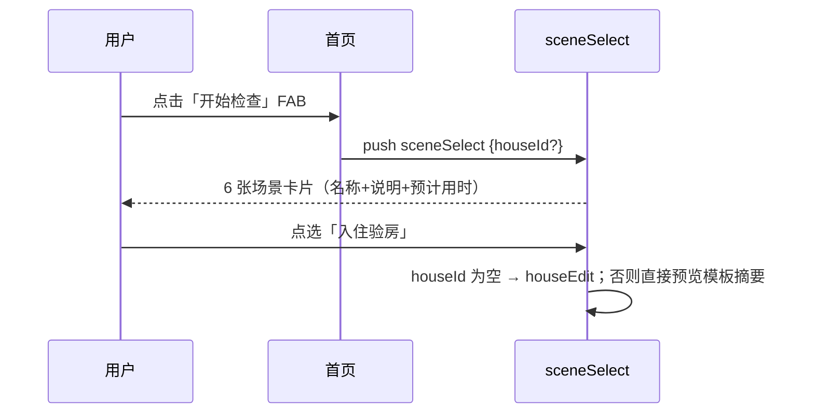

- **异常分支**：无。
- **验收**：不注册可用；从首页到模板摘要 ≤ 2 步。

## L2 建立房屋档案

**目标**：最少必填建立档案，隐私默认安全。
**数据写入**：`house` 表 1 行。

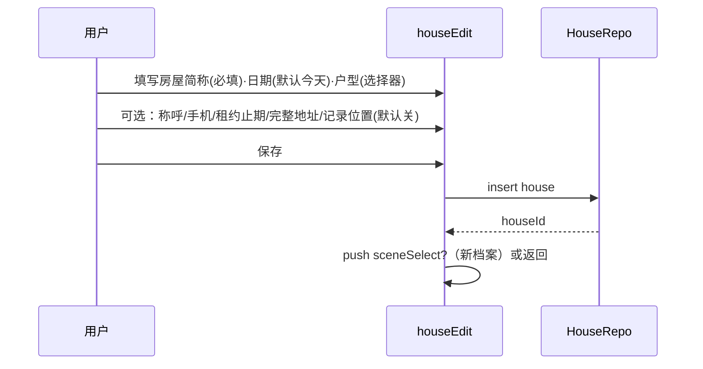

- **规则**：简称外显；完整地址存 `full_address` 且 UI 一律折叠（点击展开显示）；`record_location=false` 时不请求定位权限。
- **异常分支**：简称空 → 保存按钮禁用；手机号非 11 位 → 行内提示不阻塞。
- **验收**：仅填简称即可建档；首页卡片只见简称。

## L3 检查路线生成（模板实例化）

**目标**：按场景模板 + 户型生成"入户门→…→钥匙"的检查会话。
**数据写入**：`inspection`（DRAFT）+ `room` 若干 + `check_item` 若干（均来自模板）。

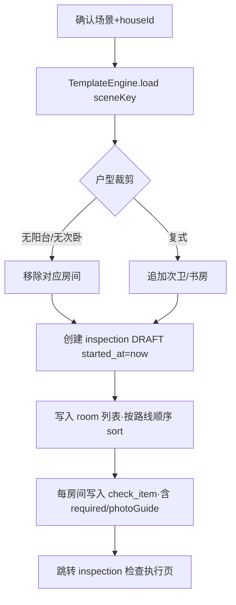

- **规则**：房间 `sort` 即检查路线；`template_key` 全链路稳定（前后对比对齐键）；退出 App 后 DRAFT 保留。
- **异常分支**：模板 JSON 缺失/损坏 → 首启解包校验失败即提示重装（不静默空模板）。
- **验收**：入住模板生成 9 房间 ~50 检查项；杀进程重进回到同一 inspection。

## L4 逐项拍照与记录（核心高频链路）

**目标**：照片与检查项强绑定、零等待、可中断。
**数据写入**：`photo` 行 + 沙箱图片文件；`check_item.status/note` 即时更新。

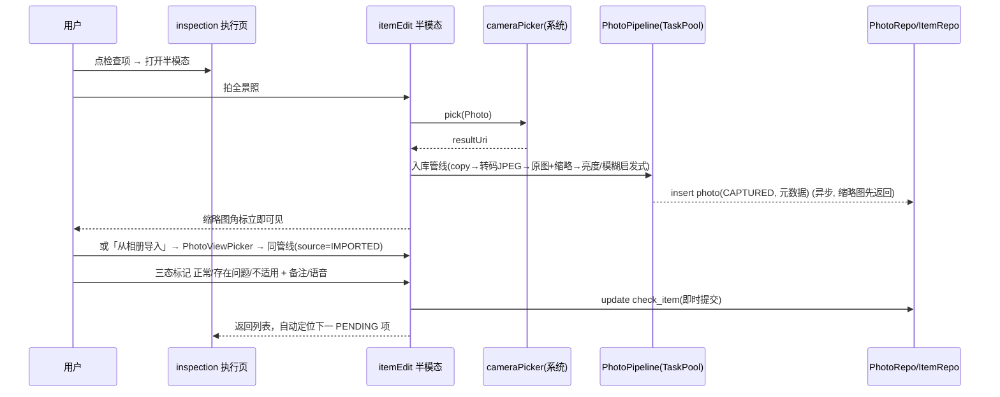

- **规则**：IMPORTED 照片全链路（列表角标 + PDF）标注"从相册导入"；质量提示（过暗/缺全景/只有文字）只在 UI 提示不拦截。
- **异常分支**：拍摄取消 → 无写入；存储 <200MB → 拍前提示；管线失败 → 项仍可标状态，照片列表显示"重试"。
- **验收**：快门→缩略图 ≤1s；连续拍 10 张无卡顿；杀进程不丢已拍照片与状态。

## L5 表数 OCR 链路

**目标**：水电燃气表读数自动化识别 + 强制人工确认。
**数据写入**：`meter_reading`（含 `confirmed` 门闩）+ `photo(kind=METER)`。

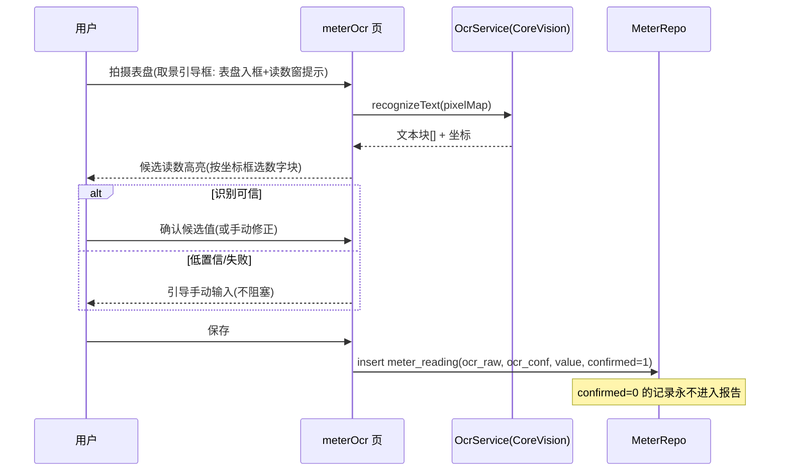

- **异常分支**：OCR 失败 → 手动输入；表具不存在 → `na_flag=1`；重复拍 → 覆盖旧 photo（保留历史可删）。
- **验收**：常见机械表/数显电表在光线正常下命中候选；确认步骤不可跳过。

## L6 语音备注与中性化链路

**目标**：语音省打字；AI 只整理语言不改事实。
**数据写入**：`check_item.note_raw / note_suggestion / note_final`。

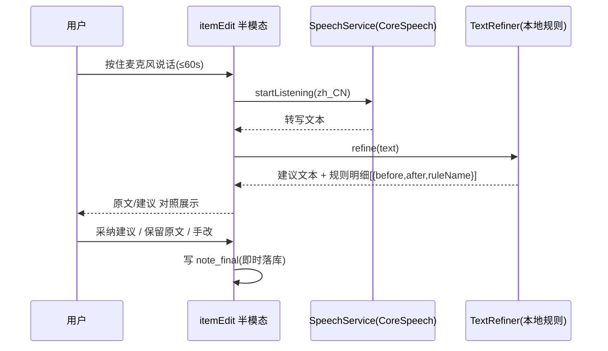

- **规则**：无权限 → 引导开权限或直接手输；60s 上限到点自动结束；每条建议可独立采纳。
- **异常分支**：识别失败/静音 → 提示重试或手输；真机不支持 → 按钮隐藏。
- **验收**：示例句"主卧窗户左下角有一条十厘米左右的裂缝"产出建议"主卧窗户左下角可见线状裂纹，长度约 10 厘米"；原文永不被覆盖。

## L7 完整性检查链路

**目标**：进入冻结前给出遗漏清单与完整度。
**数据写入**：无（纯计算 + waiver 标记写 `check_item.waiver`）。

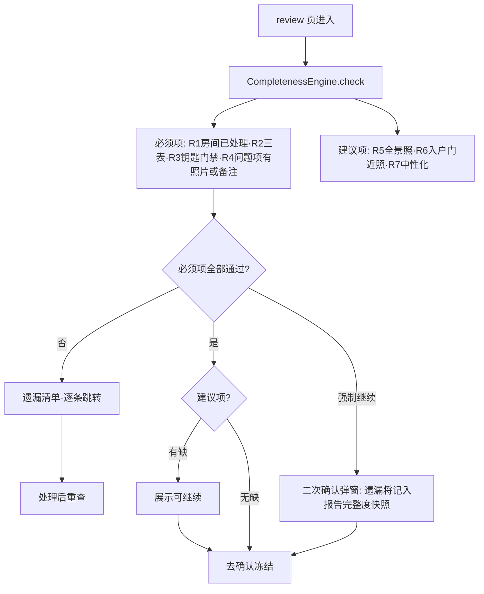

- **措辞**：标题"记录完整度"；副文案"反映本次记录的齐全程度，不代表证据效力"。
- **验收**：千项以内计算 ≤200ms；每条遗漏可一键跳转对应项/房间。

## L8 确认、签名与冻结链路（一致性核心）

**目标**：生成不可变记录 + 校验清单。
**数据写入**：`signature`、`inspection(status/report_no/frozen_at/complete_*)`、`photo.sha256`、`manifest`。

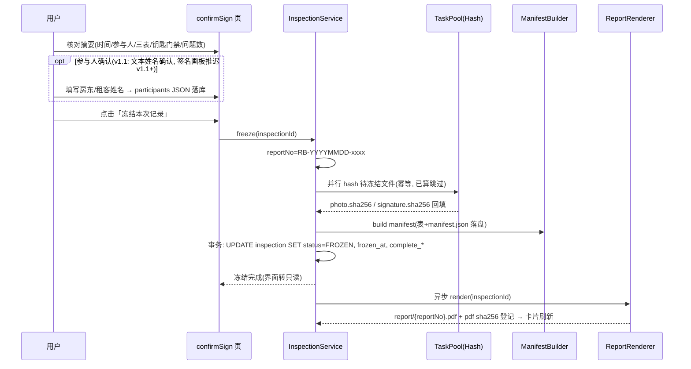

- **规则**：冻结后 UI 全只读；再次修改 → 创建修订版本（复制记录 `revision_no+1`，`parent_revision_id` 链接，老记录原样保留）。
- **异常分支**：hash 中断 → 重跑幂等；PDF 失败 → 冻结态保留，报告页"重新生成"。
- **验收**：冻结后再无任何写路径触碰冻结记录；断电/杀进程后重进状态一致；manifest 重算 hash 全部匹配。

## L9 PDF 与交付包链路

**目标**：三种产物可读、可分享、可归档。
**数据写入**：报告文件 + `pdf sha256` 登记。

```mermaid
flowchart TD
    F[冻结完成] --> RC[ReportComposer 组装 PdfDocModel]
    RC --> P1[封面: 编号/房屋/时间/参与人]
    RC --> P2[交接数据: 三表读数+照片缩略·钥匙门禁·补充说明]
    RC --> P3[逐房间页: 全景照+检查项表(状态/描述/细节照)]
    RC --> P4[问题汇总表]
    RC --> P5[确认信息页: 参与人姓名+确认时间]
    RC --> P6[校验信息页: manifest 摘要+免责文案]
    P1 & P2 & P3 & P4 & P5 & P6 --> RD[PdfKitRenderer 渲染]
    RD --> PV[reportPreview: PdfView 组件内嵌预览]
    PV --> EX[systemShare 多文件分享 PDF+manifest+原始照片 / DocumentViewPicker 逐文件导出]
```

- **PDF 规则**：内嵌图片统一用缩略 JPEG（≤1280px，控制体积）；原图以"原图编号 ↔ 文件名"映射表出现在校验页；PDF 自身 hash 生成后登记 `inspection.pdf_sha256`，在归档详情展示。
- **异常分支**：pdfService 不可用（非大陆设备/模拟器）→ 明确提示"当前设备不支持生成 PDF"（v1.1：SnapshotRenderer 已裁剪）；分享面板多文件直达，不做 zip。
- **验收**：接收方无 App 可读；30 页 PDF ≤20s；分享面板出现微信/邮件/华为分享。

## L10 归档复查与修订链路

**目标**：几个月后验证"文件没变过"，或安全地修改。

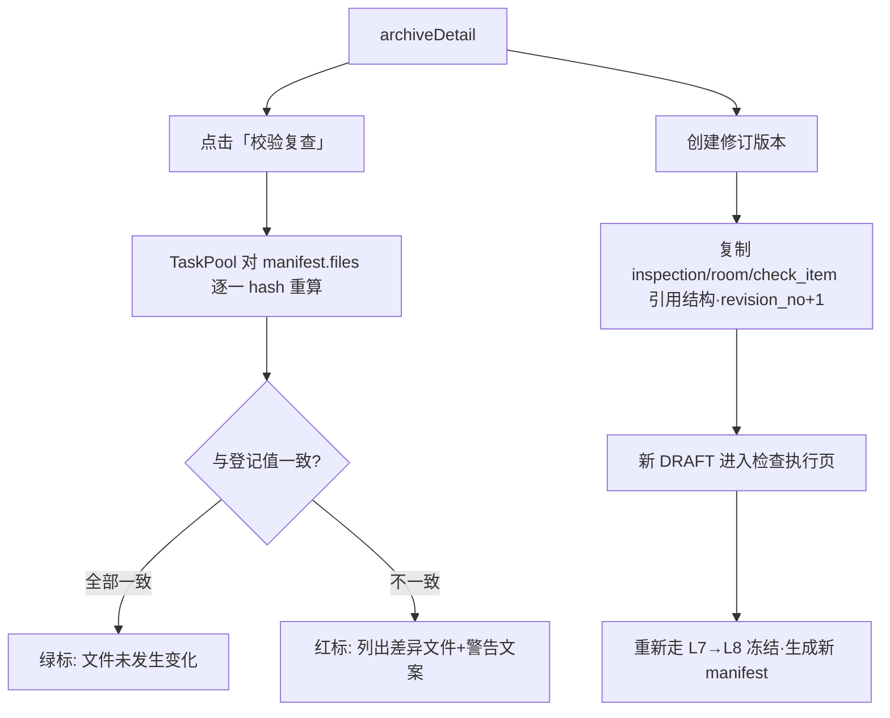

- **规则**：复查只对比 manifest 内文件；警告文案明确"检测到文件变化，不代表必然篡改（也可能是正常转存失败），请人工核对"。
- **验收**：改动任一原始文件字节后复查可检出。

## L11 退租前后对比链路

**目标**：复用入住结构，逐项对照，用户确认变化。

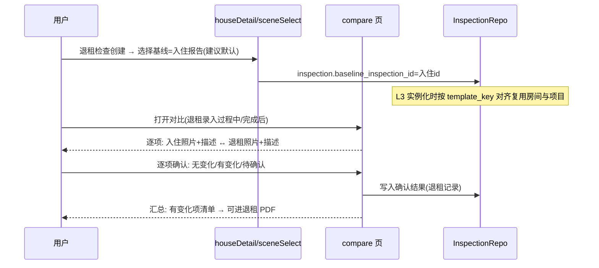

- **规则**：`template_key` 对不上的项目标"新增项"；App 只呈现不归因（不出现"由租客造成"类文案）；对比结论表进入退租 PDF 汇总。
- **验收**：同结构记录自动对齐率 100%；示例（客厅墙面无变化/冰箱门凹陷有变化）可复现。

## L12 服务卡片链路

**目标**：桌面直看"入住检查完成 18/24 项"，点击续作。

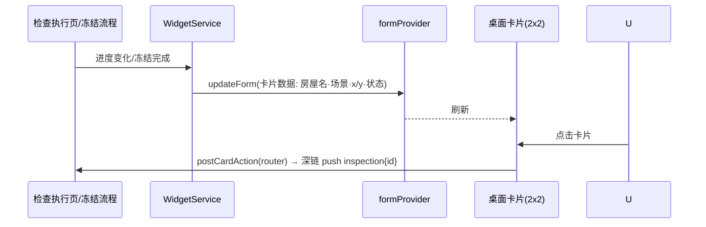

- **规则**：卡片只展示"进行中或最近冻结"的一条检查；数据变化主动刷新（不用 30 分钟定时）；多卡片绑定靠 preferences 记录 formId↔inspectionId。
- **验收**：录入一项后回桌面 3 秒内数字更新；点击直达对应检查页。

---

## 异常分支总表

| 链路 | 异常 | 处理 | 用户可见反馈 |
| --- | --- | --- | --- |
| L4 | 拍摄取消 | 无写入 | 返回原界面 |
| L4 | 存储不足 | 拍前拦截 | "剩余空间不足，请清理草稿" |
| L4 | 转码失败 | 状态可标、照片重试 | 缩略位显示重试按钮 |
| L5 | OCR 失败/低置信 | 手动输入兜底 | "未能识别，请手动输入读数" |
| L6 | 麦克风权限拒绝 | 引导设置页 | 说明用途文案 + 跳转 |
| L6 | 识别失败 | 手输 | "没听清，试试再说或直接输入" |
| L8 | hash/PDF 中断 | 幂等重跑 | "生成中断，点击重试" |
| L9 | pdfService 不可用 | 明确提示不支持生成 | "当前设备不支持生成 PDF" |
| L9 | 非大陆设备 | 真机提示（无降级渲染器） | 报告页脚注说明 |
| L10 | 校验不一致 | 红标+人工核对指引 | 不做"篡改"定性表述 |
| 全局 | 模板缺失 | 重装提示 | 启动页一次性错误卡 |
